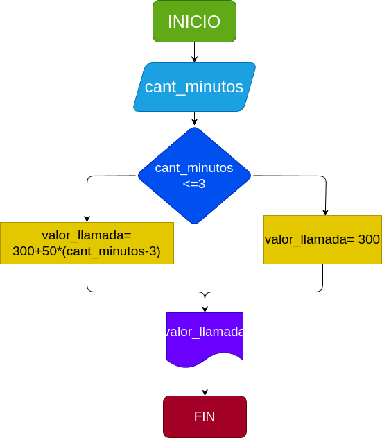

# Condicionales_1
Condicionales No.1

## Costo de una llamada telefónica

Ingresar el tiempo de duracion de una llamada telefonica y determinar la cantidad a pagar, de acuerdo a l siguiente:

- **Toda llamada que dure 3 minutos o menos tiene un costo de 300 pesos.**
- **Cada minuto adicional cuesta 50 pesos.**

## Input

- **cant_minutos**: canitdad de minutos en la llamada
## prossesing

- **valor_llamada**: valor total de la llamada

## Output

- El valor de la llamada es: " + str(valor_llamada)

## Diseño 

